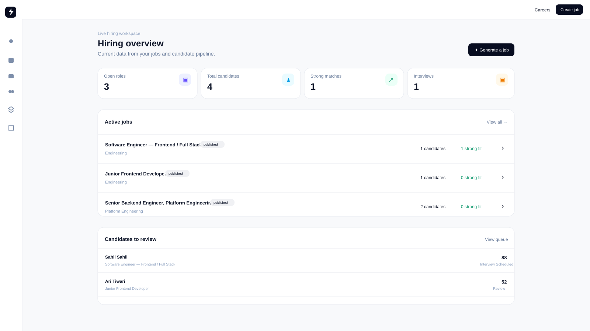

# Hireflow

Hireflow is an AI-powered hiring workspace for taking a role from an initial brief to a reviewed candidate pipeline.

## What it can do

- Generate structured, candidate-friendly job descriptions and weighted hiring rubrics from a prompt.
- Review, approve, publish, and export job postings to a public careers site.
- Receive applications and securely store resumes.
- Extract job-relevant evidence from resumes, score applicants against the approved rubric, and surface a clear recommendation for human review.
- Automatically create interview invitations for strong matches and track scheduling status.
- Provide hiring analytics plus workflow progress and AI-cost visibility.

## Built with

Next.js, React, TypeScript, Tailwind CSS, shadcn/ui, Vercel AI SDK, OpenRouter, Vercel Workflow, Neon Postgres with Drizzle ORM, Vercel Blob, Firecrawl PDF Inspector, and Cal.com.
